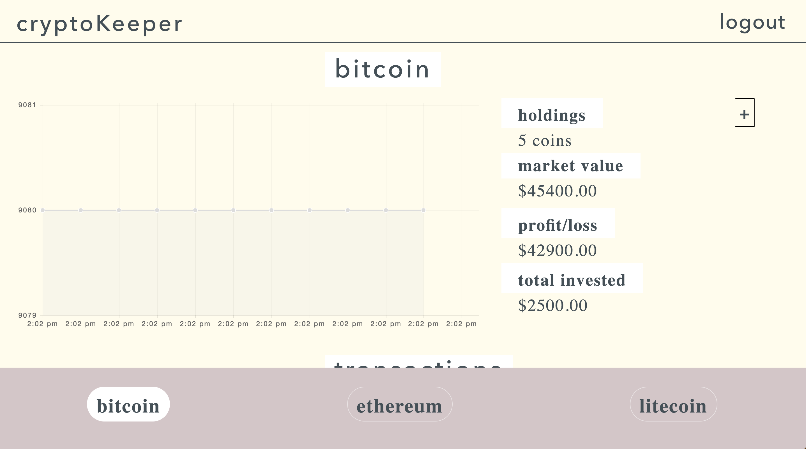
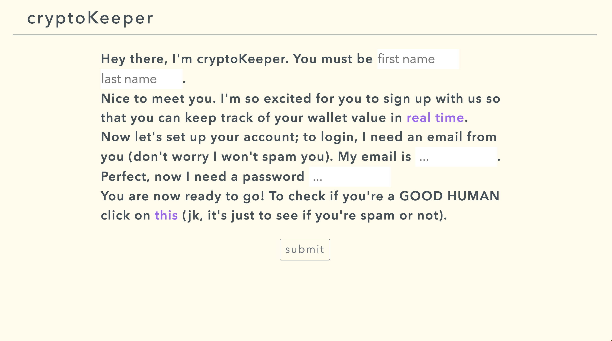
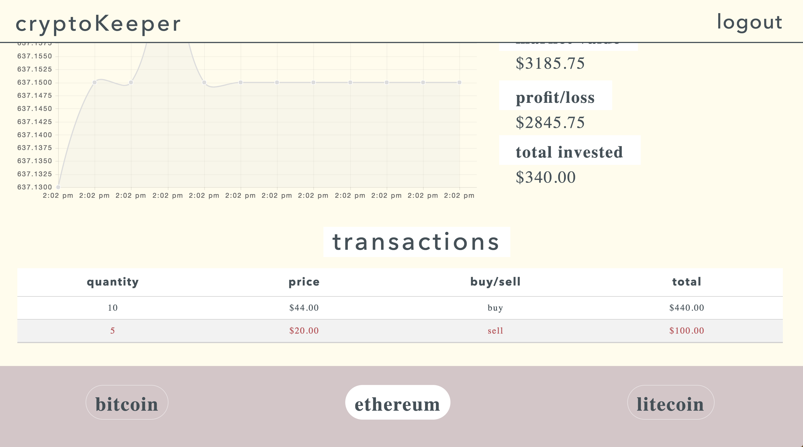
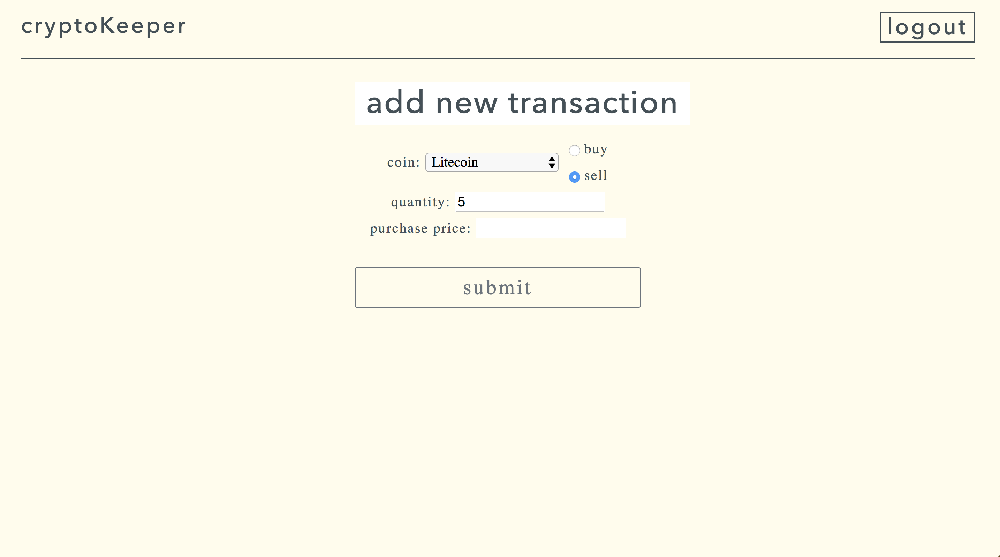

# [cryptoKeeper](http://cryptokeeper.surge.sh/)

[cryptoKeeper](http://cryptokeeper.surge.sh/) is a cryptocurrency management tool to keep track of all your investments. Utilized a websocket from GDAX to retreive real-time data from the exchange and chart.js to render the graphs.

## Built With

* [JavaScript](https://www.javascript.com/) - JavaScript
* [Node.js](https://nodejs.org/en/) - Node
* [Knex.js](http://knexjs.org/) - Knex
* [PostgreSQL](https://www.postgresql.org/) - PostgreSQL
* [Express.js](https://expressjs.com/) - Express
* [Chart.js](https://www.chartjs.org/) - Chart.js

## Links

* [http://cryptokeeper.surge.sh/](http://cryptokeeper.surge.sh/)

## GDAX WebSocket:

## Splash Screen:

## Signup Page:

## Portfolio Management:

## Add New Transaction:

